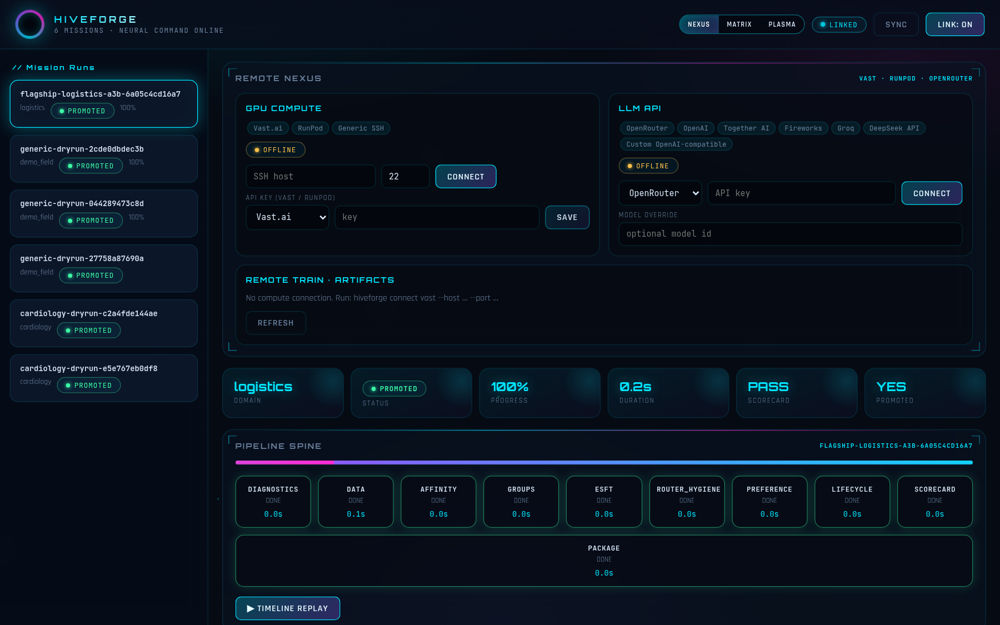
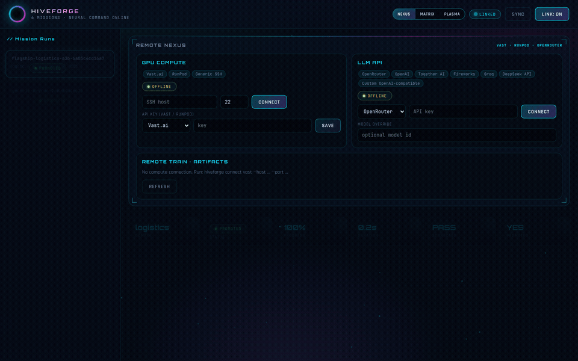

# AetherForge

**Downloadable MoE post-training tool** — carve sparse models into visual expert sectors, forensically inspect capacity, train specialist or **broad** adapters, promote gated AetherPackages.

**Full docs:** [GitHub Pages](https://AetherAwareness.github.io/aetherforge/) · **Code:** [github.com/AetherAwareness/aetherforge](https://github.com/AetherAwareness/aetherforge)





## Install

```bash
git clone https://github.com/AetherAwareness/aetherforge
cd aetherforge
bash scripts/install.sh
source .venv/bin/activate
aetherforge doctor
```

## What it does

| Feature | Description |
|---------|-------------|
| Expert Group Studio | Lattice paint, ~active-fire sectors (~13B Flash / ~3B A3B) |
| Sector forensics | What each sector contains + edit recommendations |
| Postures | specialist · broad · wide (PEFT lattice scale) |
| Flash-0731 | Fused expert PEFT (`target_parameters` + grad masks) |
| Remote train | Vast.ai / RunPod / SSH |
| Domain packs | Any industry — no hard-coded field content |

## Quick commands

```bash
aetherforge train -c configs/base.yaml -c recipes/generic_dryrun.yaml --dry-run
aetherforge validate-flash
aetherforge groups --preview --family deepseek_v4_flash --num-groups 12
aetherforge forensics --family deepseek_v4_flash --num-groups 12 --markdown
aetherforge dashboard   # http://127.0.0.1:8765/

# Broad multi-skill (2×96GB-class)
aetherforge train -c configs/base.yaml -c configs/deepseek_v4_flash.yaml \
  -c recipes/broad_flash_192gb.yaml --dry-run
```

## Remote GPU

```bash
aetherforge connect vast --host IP --port PORT
aetherforge remote launch --exec -c configs/base.yaml \
  -c configs/deepseek_v4_flash.yaml -c recipes/broad_flash_192gb.yaml
aetherforge remote pull
```

## License

MIT — see [LICENSE](LICENSE)
